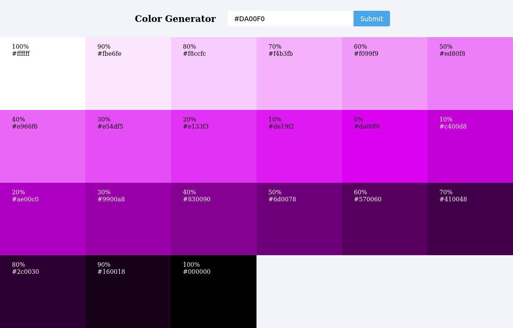

# [Color Generator](https://color-generator-nu.vercel.app/)

    
    
    
    
    

  

> React aplication to generate colors with different brightness base on the input

## 🚀 How to use the project

### 🛹 Clone the repo

`git clone https://github.com/andreseichi/color-generator.git`

or

`git@github.com:andreseichi/color-generator.git`

### 📒 Access the repo

`cd color-generator`

### 🧭 Install all dependencies with yarn

`yarn`

### 🔨 Build it

`yarn build`

## [Demo](https://color-generator-nu.vercel.app/)
